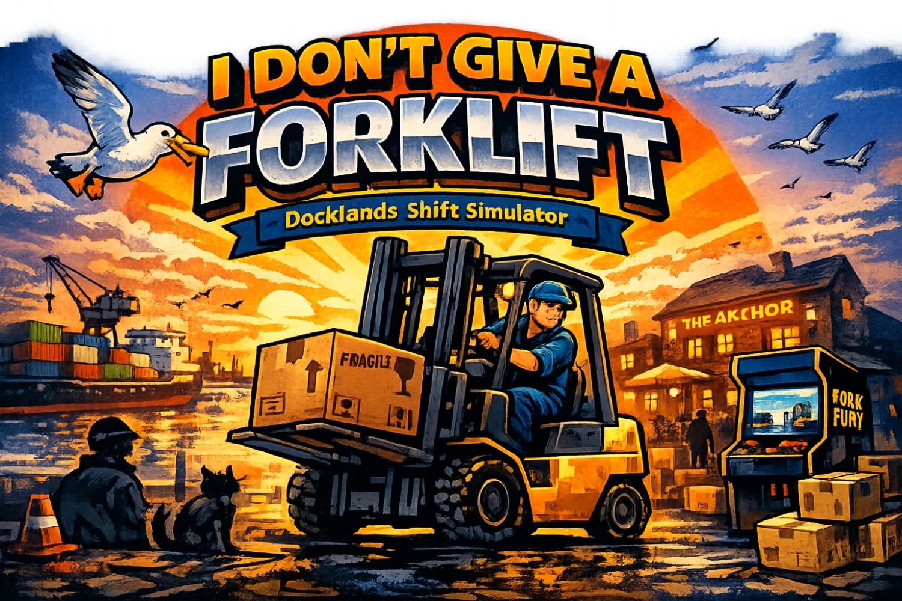

# I Don't Give A Forklift

<!-- splarg-storefront:start -->

  <strong><a href="https://splarg.itch.io/i-dont-give-a-forklift">▶ Play in browser on itch.io</a></strong>

  <a href="https://splarg.itch.io/i-dont-give-a-forklift">Screenshots & current public release</a> · <a href="https://splarg.com/">splarg.com</a>

<!-- splarg-storefront:end -->

<!-- splarg-itch-media:start -->

  

<!-- splarg-itch-media:end -->

**Docklands Shift Simulator · v1.41**

A relaxed 3D browser forklift sim inspired by the dock job in *Shenmue*. Clock in, drive the harbour, collect crates with the forks, deliver them to colour-coded destinations and try to beat yesterday's work.

**Play on itch.io:** https://splarg.itch.io/i-dont-give-a-forklift

## Modes

### Five-Minute Rush

Start in the driver's seat with a short timer, local delivery routes, bonus targets and a medal to chase.

### Dock Shift

Clock in and work at your own pace. Explore the harbour, take jobs, earn pay and finish the shift when you want.

Your current shift can be saved and continued later.

## Features

- 3D forklift driving with momentum and reversing audio
- Proper fork raise/lower controls
- Load and unload jobs around the docks
- Precision-drop and streak bonuses
- Persistent earnings and forklift upgrades
- Speed, brake and hydraulic upgrades
- Day/night cycle and changing weather
- Minimap and navigation arrow
- First-person and isometric camera modes
- Keyboard and standard gamepad support
- Shift summaries and personal bests
- Local save data

## Controls

- **WASD / Arrow keys** — drive and steer
- **E / Q** — raise / lower forks
- **Shift** — brake
- **F** — get in / out of the forklift
- **Space** — interact
- **P / Esc** — pause
- **Tab** — map
- **R** — rotate camera
- **Z / X** — zoom
- **V** — first-person view
- **H** — horn
- **M** — music

To collect a crate, line up the forks and raise them with **E**. Lower the crate with **Q** inside its target to deliver it.

## Run locally

Open the root `index.html` in a modern browser.

The game has no build step, but it loads Three.js from cdnjs, so an internet connection is required on first load unless you replace that dependency with a local copy.

## Source status

The root `index.html` is the current **v1.41** release source (5 October 2026), a bug-fix update to v1.40.

The original **v1.40** release, preserved on **19 September 2026**, is kept unchanged at `development/forklift-simulator-v1.40.html` and remains recoverable in Git history.

### v1.41 fixes

- Minimap heading arrow no longer points backwards when facing north or south; the first-person navigation arrow is no longer mirrored
- Ending a shift from the pause menu during Fork Fury no longer starts the next game stuck in the arcade
- Tying the arcade high score no longer claims a new record
- Camera, zoom, lorry-arrival and arcade-score notices now stay on screen long enough to read
- Clock-in closes at 10 PM instead of starting an empty shift that wiped yesterday's comparison
- The upgrade purchase chime plays; music no longer drones under the pause menu or holds a note while sleeping
- Losing focus while falling asleep now pauses the next day instead of running it muted
- Lorry, AI forklift and traffic headlights work at night when you're on foot
- The pub's front wall is solid either side of the door
- The idle lorry is hidden instead of waiting visibly, and drivable-through, inside the map
- A new game clears a stale time-speed label; the gamepad Back button only toggles lights while driving

## Technology

HTML / CSS / JavaScript / Three.js.
